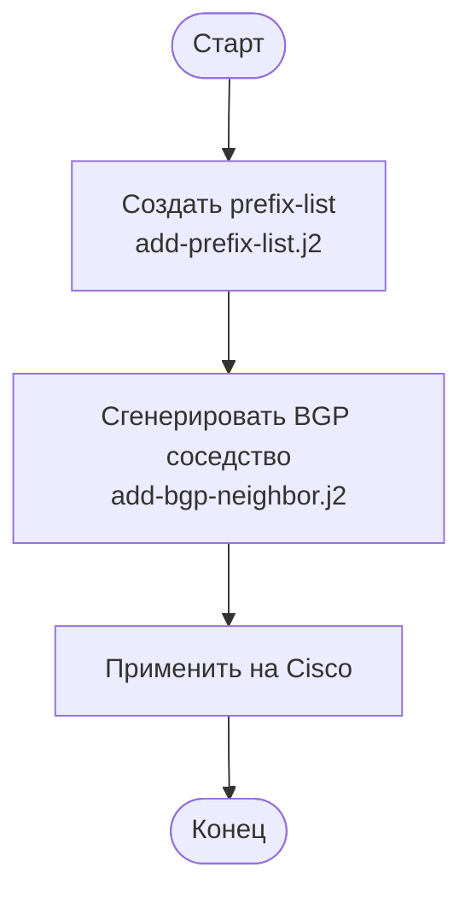

1. **Создайте/Выберите prefix-list**  
   При необходимости, создайте prefix-list с помощью шаблона `add-prefix-list.j2`.

2. **Подготовьте переменные для BGP**  
   ```
   local_as: <ASN этого роутера>
   neighbor_ip: <IP адрес соседа>
   neighbor_as: <ASN соседа>
   description: <Описание, опционально>
   update_source: <Интерфейс, например Loopback0 или Tunnel1>
   prefix_lists_in: [<имя prefix-list для входа>]
   prefix_lists_out: [<имя prefix-list для выхода>]
   ```

3. **Сгенерируйте конфигурацию**  
   Используйте `add-bgp-neighbor.j2` и вышеуказанные переменные.

4. **Примените конфиг на Cisco**  
   Вставьте команды в конфигурационный режим.

---

## Пример файлов и последовательность



---

> Все переменные подставляются вручную либо интерактивным рендерером шаблонов  
> Для каждого BGP-соседа рекомендуется использовать уникальные фильтры/префикс-листы