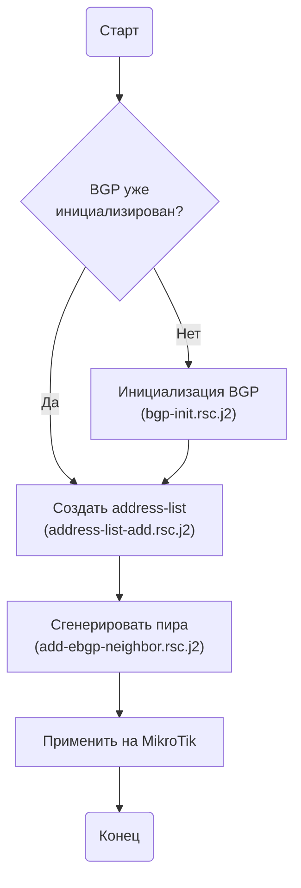

### Если BGP ещё не инициализирован (выполняется один раз)
1. **Инициализируйте BGP**  
   Рендерите шаблон `templates/mikrotik/routeros-7.x/bgp-init.rsc.j2`:
   ```yaml
   local_as: <локальная ASN>
   router_id: <IP-адрес router-id, обычно Loopback>
   routing_table: main   # опционально, по умолчанию main
   ```

### Общие шаги для каждого пира
2. **Создайте address-list для анонсов (при необходимости)**  
   Используйте шаблон `templates/mikrotik/routeros-7.x/address-list-add.rsc.j2`:
   ```yaml
   address_list_name: <имя списка, напр. NET-TO-HQ>
   addresses: 
     - 10.0.0.0/24
     - 192.168.1.0/20
   ```

3. **Подготовьте переменные для пира**
   ```yaml
   neighbor_name: <уникальное имя сессии, напр. EBGP-TO-HQ>
   local_tunnel_ip: <локальный IP в туннеле>
   remote_tunnel_ip: <IP соседа в туннеле>
   remote_as: <ASN соседа>
   accepted_prefixes: 
     - 172.16.0.0/12
     - 203.0.113.0/24
   out_networks_list: <имя address-list из шага 2, опционально>
   in_filter_name: <имя цепочки фильтра, по умолчанию bgp-in>
   ```

4. **Сгенерируйте конфигурацию пира**  
   Рендерите шаблон `templates/mikrotik/routeros-7.x/add-ebgp-neighbor.rsc.j2`.

5. **Примените на устройстве**  
   Вставьте полученные команды в терминал MikroTik.

## Последовательность

